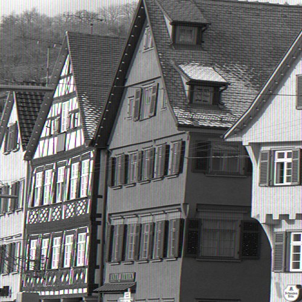

## Q1-Q10
### 1. 通道交换

读取图像，然后将RGB通道替换为BGR通道

|   输入   |   输出    | 
| ---- | ---- |
|      |      | 

### 2. 灰度化
灰度是一种图像亮度的表示方法，通过下面方式计算：

$$
Y = 0.2126 \cdot R + 0.7152 \cdot G + 0.0722 \cdot B
$$

|   输入   |   输出    | 
| ---- | ---- |
|      |      | 

### 3. 二值化
二值化是将图像使用黑和白两种颜色表示的方法，通常将灰度的阈值设置为128来进行二值化。小于阈值的像素被设置为0，大于或等于阈值的像素被设置为255

|   输入   |   输出    | 
| ---- | ---- |
|      |      | 

### 4. 大津二值化（Otsu's Method）
大津算法，也被称为**最大类间方差法**，是一种可以**自动确定**二值化中**阈值**的算法。从**类内方差**和**类间方差**的**比值**计算得来：
- 小于阈值 $t$ 的类记作0，大于阈值 $t$ 的类记作1
- $w_0, w_1$ 是被阈值 $t$ 分开的两个类中的像素数占总像素的比率  $w_0+w_1 = 1$
- $S_0^2, S_1^2$分别是两个类中像素值的方差
- $M_0, M_1$是这两个类中像素值的平均值

因此，相关的计算如下：
- 类内方差： $S_w^2 = w_0 \cdot S_0^2 + w_1\cdot S_1^2$
- 类间方差： $S_b^2 = w_0(M_0 - M_t)^2 + w_1(M_1 - M_t)^2 = w_0\cdot w_1(M_0 - M_1)^2$
- 图像所有像素的方差： $S_t^2 = S_w^2 + S_b^2=$  常数

根据以上公式，使用以下公式计算**分离度**$X$：

$$
X = \frac{S_b^2}{S_w^2} = \frac{S_b^2}{S_t^2 - S_b^2}
$$

也就是说：

$$
\mathop{\arg\max}_{t} \mathbf X = \mathop{\arg\max}_t S_b^2
$$

|   输入   |   输出    | 
| ---- | ---- |
|      |      | 

### 5. HSV变换
HSV即使用色相（Hue）、饱和度（Saturation）和明度（Value）来表示色彩：
- 色相：将颜色使用0°~360°表示，如红色是0°，黄色是60°
- 饱和度：色彩的纯度，饱和度越低则颜色越暗淡 $0\le S <1$
- 明度：颜色的明亮程度，数值越高越接近白色，数值越低越接近黑色 $0\le V < 1$
  
将通过以下方式从RGB色彩表示转换到HSV色彩表示，RGB的取值范围为 $[0, 1]$，令：

$$
\max = \max(R, G, B)\\
\min = \min(R, G, B) 
$$

则，HSV的三个属性分别计算如下：

$$
H(ue) = \left\{ \begin{array}{l}
0, (\text{if} \min == \max)\\
60 \cdot \frac{G - R}{\max - \min} + 60,  (\text{if} \min == B)\\
60 \cdot \frac{B - G}{\max - \min} + 180,  (\text{if} \min == R)\\
60 \cdot \frac{R - B}{\max - \min} + 300,  (\text{if} \min == G)\\
\end{array} \right. 
$$

$$
S(aturation)=\max - \min \\
V(alue) = \max
$$

从HSV色彩转换到RGB色彩通过以下上式计算：

$$
C = S \\
H' = \frac{H}{60}\\
X = C\cdot (1 - |H' \% 2 - 1|)\\
$$

$$
(R, G, B) = (V - C) \cdot (1, 1, 1) + \left\{ \begin{array}{l}
(0, 0, 0), (\text{if H is undefined})\\
(C, X, 0), (\text{if } 0\le H'<1)\\
(X, C, 0), (\text{if } 1\le H'<2)\\
(0, C, X), (\text{if } 2\le H'<3)\\
(0, X, C), (\text{if } 3\le H'<4)\\
(X, 0, C), (\text{if } 4\le H'<5)\\
(C, 0, X), (\text{if } 5\le H'<6)\\
\end{array} \right.
$$

**接下来将色相反转（色相值加180）**，然后再用RGB色彩图像表示图片

|   输入   |   输出    | 
| ---- | ---- |
|      |      | 

